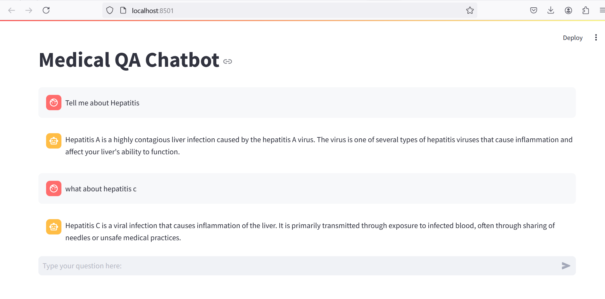

# qna-bot

## This is a Q&A chatbot

### Stack

- **Vector search**: Postgres, Pgvector
- **API**: Flask
- **UI**: Streamlit
- **Embeddings**: thenlper/gte-large (LLM)
- **Datasets**: 
  - (simple data)https://www.kaggle.com/datasets/mouadenna/simple-q-and-a-medical-dataset-jsonl/, 
  - (complex data)https://www.kaggle.com/datasets/thedevastator/comprehensive-medical-q-a-dataset

### Setting up locally
- Clone the repo with `git clone https://github.com/oceakun/qna_bot.git`
- Run `pip install -r requirements.txt`
- Setup the database
  - Install postgres and pgvector
  - Create a new database and apply the 'pgvector' extension on it
  - Create a .env file at ./ and set the database credentials
  - Download the simple data from urls mentioned in last section and move the .jsonl to 'vector_db_setup' after extracting it from the zip file
  - Navigate to 'vector_db_setup' with `cd vector_db_setup` 
  - Convert .jsonl file to .csv with `python3 json_to_csv.py`
  - Run `python3 create_and_save_embeddings.py`, this will create embeddings for the data, store it in the database (that you set credentials for) amd index it as well
- Navigate to root and run the Flask server with `python3 main.py`
- Run `streamlit chatbot_ui.py` to run the UI, wherefrom you can interact with the data through vector search abstracted behind textual queries

NOTE: Running `python3 create_and_save_embeddings.py` will install the LLM 'thenlper/gte-large' on your system